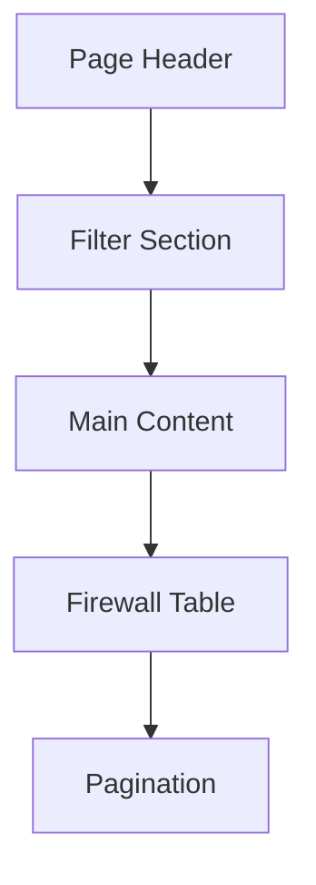

# Styling Guide for Firewalls Page

This document provides comprehensive styling instructions for the Fortinet-Web Firewalls page to make it more professional, appealing, and consistent with modern design principles.

## Table of Contents

1. [Page Layout and Structure](#1-page-layout-and-structure)
2. [Table Styling](#2-table-styling)
3. [Pagination Styling](#3-pagination-styling)
4. [Responsive Design](#4-responsive-design)
5. [Complete Implementation](#5-complete-implementation)
6. [Additional Recommendations](#6-additional-recommendations)
7. [Mobile Responsiveness](#7-mobile-responsiveness)
8. [Animation and Interaction](#8-animation-and-interaction)

## 1. Page Layout and Structure

### Page Flow



### 1.1. Enhanced Page Header

Replace the current h1 with a more professional header section:

```tsx
<div className="flex items-center justify-between pb-6 border-b">
  <div>
    <h1 className="text-3xl font-bold tracking-tight">Firewalls</h1>
    <p className="text-sm text-muted-foreground mt-1">
      Manage and monitor your Fortinet firewall devices
    </p>
  </div>
  <div className="flex items-center gap-2">
    <Button variant="outline" size="sm">
      <span className="mr-2">Export</span>
      <svg xmlns="http://www.w3.org/2000/svg" width="16" height="16" viewBox="0 0 24 24" fill="none" stroke="currentColor" strokeWidth="2" strokeLinecap="round" strokeLinejoin="round" className="lucide lucide-download"><path d="M21 15v4a2 2 0 0 1-2 2H5a2 2 0 0 1-2-2v-4"/><polyline points="7 10 12 15 17 10"/><line x1="12" y1="15" x2="12" y2="3"/></svg>
    </Button>
    <Button size="sm">
      <span className="mr-2">Refresh</span>
      <svg xmlns="http://www.w3.org/2000/svg" width="16" height="16" viewBox="0 0 24 24" fill="none" stroke="currentColor" strokeWidth="2" strokeLinecap="round" strokeLinejoin="round" className="lucide lucide-refresh-cw"><path d="M3 12a9 9 0 0 1 9-9 9.75 9.75 0 0 1 6.74 2.74L21 8"/><path d="M21 3v5h-5"/><path d="M21 12a9 9 0 0 1-9 9 9.75 9.75 0 0 1-6.74-2.74L3 16"/><path d="M3 21v-5h5"/></svg>
    </Button>
  </div>
</div>
```

### 1.2. Improved Filter Card

Enhance the filter card with a subtle background and icon:

```tsx
<Card className="border shadow-sm">
  <CardHeader className="bg-muted/50 pb-3">
    <CardTitle className="text-lg flex items-center">
      <svg xmlns="http://www.w3.org/2000/svg" width="18" height="18" viewBox="0 0 24 24" fill="none" stroke="currentColor" strokeWidth="2" strokeLinecap="round" strokeLinejoin="round" className="mr-2"><polygon points="22 3 2 3 10 12.46 10 19 14 21 14 12.46 22 3"/></svg>
      Filter Options
    </CardTitle>
  </CardHeader>
  <CardContent className="pt-4">
    <FirewallsFilter initialFirewallName={fw_name} />
  </CardContent>
</Card>
```

### 1.3. Enhanced Main Content Card

Improve the main content card with better header styling and information display:

```tsx
<Card className="border shadow-sm">
  <CardHeader className="bg-muted/50 pb-3 flex flex-row items-center justify-between">
    <div>
      <CardTitle className="text-lg flex items-center">
        <svg xmlns="http://www.w3.org/2000/svg" width="18" height="18" viewBox="0 0 24 24" fill="none" stroke="currentColor" strokeWidth="2" strokeLinecap="round" strokeLinejoin="round" className="mr-2"><rect width="20" height="14" x="2" y="5" rx="2"/><line x1="2" x2="22" y1="10" y2="10"/></svg>
        Firewall Devices
      </CardTitle>
      <CardDescription>
        Total: {totalCount} devices
      </CardDescription>
    </div>
    <div className="flex items-center gap-2">
      <div className="text-sm text-muted-foreground">
        {firewalls.length > 0 ? 
          `Showing ${(currentPage - 1) * currentPageSize + 1}-${Math.min(currentPage * currentPageSize, totalCount)} of ${totalCount}` : 
          'No firewalls found'}
      </div>
    </div>
  </CardHeader>
  <CardContent className="p-0">
    {/* Table content will go here */}
  </CardContent>
</Card>
```

## 2. Table Styling

### 2.1. Enhanced Table Header

Improve the table header with better typography and styling:

```tsx
<Table className="border-collapse">
  <TableHeader className="bg-muted/50">
    <TableRow className="hover:bg-muted/20">
      <TableHead className="font-medium text-xs uppercase tracking-wider text-muted-foreground py-3">Firewall Name</TableHead>
      <TableHead className="font-medium text-xs uppercase tracking-wider text-muted-foreground py-3">IP Address</TableHead>
      <TableHead className="font-medium text-xs uppercase tracking-wider text-muted-foreground py-3">FortiManager IP</TableHead>
      <TableHead className="font-medium text-xs uppercase tracking-wider text-muted-foreground py-3">FortiAnalyzer IP</TableHead>
      <TableHead className="font-medium text-xs uppercase tracking-wider text-muted-foreground py-3">VDoms</TableHead>
      <TableHead className="font-medium text-xs uppercase tracking-wider text-muted-foreground py-3">Last Updated</TableHead>
    </TableRow>
  </TableHeader>
  {/* Table body will go here */}
</Table>
```

### 2.2. Enhanced Table Body

Improve the table body with better styling and data presentation:

```tsx
<TableBody>
  {firewalls.length === 0 ? (
    <TableRow>
      <TableCell colSpan={6} className="text-center py-6 text-muted-foreground">
        No firewalls found
      </TableCell>
    </TableRow>
  ) : (
    firewalls.map((firewall) => (
      <TableRow key={firewall.firewall_id} className="hover:bg-muted/20 border-b">
        <TableCell className="font-medium">{firewall.fw_name}</TableCell>
        <TableCell>
          <code className="px-2 py-1 bg-muted rounded text-sm">{firewall.fw_ip}</code>
        </TableCell>
        <TableCell>{firewall.fmg_ip === 'None' || firewall.fmg_ip === 'n/a' ? '-' : firewall.fmg_ip || '-'}</TableCell>
        <TableCell>{firewall.faz_ip === 'None' || firewall.faz_ip === 'n/a' ? '-' : firewall.faz_ip || '-'}</TableCell>
        <TableCell>
          <HoverCard>
            <HoverCardTrigger asChild>
              <Badge variant="outline" className="cursor-help flex items-center space-x-1 hover:bg-primary/10">
                <span className="w-2 h-2 bg-primary rounded-full"></span>
                <span>VDoms ({firewall.total_vdoms || 0})</span>
              </Badge>
            </HoverCardTrigger>
            <HoverCardContent className="w-80 p-0">
              <div className="bg-muted/50 p-3 border-b">
                <h4 className="font-semibold">List of VDoms for {firewall.fw_name}</h4>
              </div>
              <VdomsList firewallId={firewall.firewall_id} firewallName={firewall.fw_name} />
            </HoverCardContent>
          </HoverCard>
        </TableCell>
        <TableCell>
          <div className="flex items-center">
            <svg xmlns="http://www.w3.org/2000/svg" width="14" height="14" viewBox="0 0 24 24" fill="none" stroke="currentColor" strokeWidth="2" strokeLinecap="round" strokeLinejoin="round" className="mr-2 text-muted-foreground"><circle cx="12" cy="12" r="10"/><polyline points="12 6 12 12 16 14"/></svg>
            <span className="text-sm">{new Date(firewall.last_updated).toLocaleString()}</span>
          </div>
        </TableCell>
      </TableRow>
    ))
  )}
</TableBody>
```

### 2.3. Improved VDoms List

Enhance the VDoms list with better styling and visual indicators:

```tsx
async function VdomsList({ firewallId, firewallName }: { firewallId: number, firewallName: string }) {
  const { items: vdoms } = await getVdoms({ firewall_id: firewallId.toString() });
  
  return (
    <div className="p-3">
      <ScrollArea className="h-[200px] w-full">
        {vdoms.length > 0 ? (
          <div className="space-y-1">
            {vdoms.map((vdom: VDOMResponse) => (
              <div key={vdom.vdom_id} className="flex items-center p-2 rounded hover:bg-muted">
                <div className="w-2 h-2 bg-primary rounded-full mr-2"></div>
                <span>{vdom.vdom_name}</span>
              </div>
            ))}
          </div>
        ) : (
          <div className="text-center py-4 text-muted-foreground">
            No VDoms found
          </div>
        )}
      </ScrollArea>
    </div>
  );
}
```

## 3. Pagination Styling

Enhance the pagination section with better styling and information display:

```tsx
<div className="border-t p-4">
  <div className="flex items-center justify-between">
    <div className="text-sm text-muted-foreground">
      Showing {(currentPage - 1) * pageSize + 1}-{Math.min(currentPage * pageSize, totalCount)} of {totalCount} firewalls
    </div>
    <DataPagination currentPage={page} totalPages={totalPages} />
  </div>
</div>
```

## 4. Responsive Design

Improve the responsiveness of the page:

```tsx
// Add these classes to the main container div
<div className="space-y-6 max-w-7xl mx-auto">
  {/* Content */}
</div>

// Make the table responsive
<div className="overflow-auto">
  <Table>
    {/* Table content */}
  </Table>
</div>
```

## 5. Complete Implementation

Here's the complete implementation of the styled firewalls page:

```tsx
import { Card, CardContent, CardDescription, CardHeader, CardTitle } from "@/components/ui/card";
import { Table, TableBody, TableCell, TableHead, TableHeader, TableRow } from "@/components/ui/table";
import { HoverCard, HoverCardContent, HoverCardTrigger } from "@/components/ui/hover-card";
import { DataPagination } from "@/components/data-pagination";
import { FirewallsFilter } from "./components/firewalls-filter";
import { getFirewalls, getVdoms } from "@/services/api";
import { VDOMResponse } from "@/types";
import { ScrollArea } from "@/components/ui/scroll-area";
import { Badge } from "@/components/ui/badge";
import { Button } from "@/components/ui/button";
import { VdomsButton } from "./components/vdoms-button";

export default async function FirewallsPage({
  searchParams,
}: {
  searchParams: { fw_name?: string; page?: string; pageSize?: string };
}) {
  const searchParamsObj = await searchParams;
  const fw_name = searchParamsObj.fw_name;
  const page = searchParamsObj.page ? Number(searchParamsObj.page) : 1;
  const pageSize = searchParamsObj.pageSize ? Number(searchParamsObj.pageSize) : 15;
  
  // Build filter object
  const filters: Record<string, string> = {};
  if (fw_name) filters.fw_name = fw_name;
  
  // Add pagination params
  const currentPage = page;
  const currentPageSize = pageSize;
  filters.skip = ((currentPage - 1) * currentPageSize).toString();
  filters.limit = currentPageSize.toString();
  
  // Fetch data with filters
  const { items: firewalls, total_count: totalCount } = await getFirewalls(filters);
  const totalPages = Math.ceil(totalCount / pageSize);
  
  return (
    <div className="space-y-6 max-w-7xl mx-auto">
      {/* Enhanced Page Header */}
      <div className="flex items-center justify-between pb-6 border-b">
        <div>
          <h1 className="text-3xl font-bold tracking-tight">Firewalls</h1>
          <p className="text-sm text-muted-foreground mt-1">
            Manage and monitor your Fortinet firewall devices
          </p>
        </div>
        <div className="flex items-center gap-2">
          <Button variant="outline" size="sm">
            <span className="mr-2">Export</span>
            <svg xmlns="http://www.w3.org/2000/svg" width="16" height="16" viewBox="0 0 24 24" fill="none" stroke="currentColor" strokeWidth="2" strokeLinecap="round" strokeLinejoin="round" className="lucide lucide-download"><path d="M21 15v4a2 2 0 0 1-2 2H5a2 2 0 0 1-2-2v-4"/><polyline points="7 10 12 15 17 10"/><line x1="12" y1="15" x2="12" y2="3"/></svg>
          </Button>
          <Button size="sm">
            <span className="mr-2">Refresh</span>
            <svg xmlns="http://www.w3.org/2000/svg" width="16" height="16" viewBox="0 0 24 24" fill="none" stroke="currentColor" strokeWidth="2" strokeLinecap="round" strokeLinejoin="round" className="lucide lucide-refresh-cw"><path d="M3 12a9 9 0 0 1 9-9 9.75 9.75 0 0 1 6.74 2.74L21 8"/><path d="M21 3v5h-5"/><path d="M21 12a9 9 0 0 1-9 9 9.75 9.75 0 0 1-6.74-2.74L3 16"/><path d="M3 21v-5h5"/></svg>
          </Button>
        </div>
      </div>
      
      {/* Enhanced Filter Card */}
      <Card className="border shadow-sm">
        <CardHeader className="bg-muted/50 pb-3">
          <CardTitle className="text-lg flex items-center">
            <svg xmlns="http://www.w3.org/2000/svg" width="18" height="18" viewBox="0 0 24 24" fill="none" stroke="currentColor" strokeWidth="2" strokeLinecap="round" strokeLinejoin="round" className="mr-2"><polygon points="22 3 2 3 10 12.46 10 19 14 21 14 12.46 22 3"/></svg>
            Filter Options
          </CardTitle>
        </CardHeader>
        <CardContent className="pt-4">
          <FirewallsFilter initialFirewallName={fw_name} />
        </CardContent>
      </Card>
      
      {/* Enhanced Main Content Card */}
      <Card className="border shadow-sm">
        <CardHeader className="bg-muted/50 pb-3 flex flex-row items-center justify-between">
          <div>
            <CardTitle className="text-lg flex items-center">
              <svg xmlns="http://www.w3.org/2000/svg" width="18" height="18" viewBox="0 0 24 24" fill="none" stroke="currentColor" strokeWidth="2" strokeLinecap="round" strokeLinejoin="round" className="mr-2"><rect width="20" height="14" x="2" y="5" rx="2"/><line x1="2" x2="22" y1="10" y2="10"/></svg>
              Firewall Devices
            </CardTitle>
            <CardDescription>
              Total: {totalCount} devices
            </CardDescription>
          </div>
          <div className="flex items-center gap-2">
            <div className="text-sm text-muted-foreground">
              {firewalls.length > 0 ? 
                `Showing ${(currentPage - 1) * currentPageSize + 1}-${Math.min(currentPage * currentPageSize, totalCount)} of ${totalCount}` : 
                'No firewalls found'}
            </div>
          </div>
        </CardHeader>
        <CardContent className="p-0">
          <div className="overflow-auto">
            <Table className="border-collapse">
              <TableHeader className="bg-muted/50">
                <TableRow className="hover:bg-muted/20">
                  <TableHead className="font-medium text-xs uppercase tracking-wider text-muted-foreground py-3">Firewall Name</TableHead>
                  <TableHead className="font-medium text-xs uppercase tracking-wider text-muted-foreground py-3">IP Address</TableHead>
                  <TableHead className="font-medium text-xs uppercase tracking-wider text-muted-foreground py-3">FortiManager IP</TableHead>
                  <TableHead className="font-medium text-xs uppercase tracking-wider text-muted-foreground py-3">FortiAnalyzer IP</TableHead>
                  <TableHead className="font-medium text-xs uppercase tracking-wider text-muted-foreground py-3">VDoms</TableHead>
                  <TableHead className="font-medium text-xs uppercase tracking-wider text-muted-foreground py-3">Last Updated</TableHead>
                </TableRow>
              </TableHeader>
              <TableBody>
                {firewalls.length === 0 ? (
                  <TableRow>
                    <TableCell colSpan={6} className="text-center py-6 text-muted-foreground">
                      No firewalls found
                    </TableCell>
                  </TableRow>
                ) : (
                  firewalls.map((firewall) => (
                    <TableRow key={firewall.firewall_id} className="hover:bg-muted/20 border-b">
                      <TableCell className="font-medium">{firewall.fw_name}</TableCell>
                      <TableCell>
                        <code className="px-2 py-1 bg-muted rounded text-sm">{firewall.fw_ip}</code>
                      </TableCell>
                      <TableCell>{firewall.fmg_ip === 'None' || firewall.fmg_ip === 'n/a' ? '-' : firewall.fmg_ip || '-'}</TableCell>
                      <TableCell>{firewall.faz_ip === 'None' || firewall.faz_ip === 'n/a' ? '-' : firewall.faz_ip || '-'}</TableCell>
                      <TableCell>
                        <HoverCard>
                          <HoverCardTrigger asChild>
                            <Badge variant="outline" className="cursor-help flex items-center space-x-1 hover:bg-primary/10">
                              <span className="w-2 h-2 bg-primary rounded-full"></span>
                              <span>VDoms ({firewall.total_vdoms || 0})</span>
                            </Badge>
                          </HoverCardTrigger>
                          <HoverCardContent className="w-80 p-0">
                            <div className="bg-muted/50 p-3 border-b">
                              <h4 className="font-semibold">List of VDoms for {firewall.fw_name}</h4>
                            </div>
                            <VdomsList firewallId={firewall.firewall_id} firewallName={firewall.fw_name} />
                          </HoverCardContent>
                        </HoverCard>
                      </TableCell>
                      <TableCell>
                        <div className="flex items-center">
                          <svg xmlns="http://www.w3.org/2000/svg" width="14" height="14" viewBox="0 0 24 24" fill="none" stroke="currentColor" strokeWidth="2" strokeLinecap="round" strokeLinejoin="round" className="mr-2 text-muted-foreground"><circle cx="12" cy="12" r="10"/><polyline points="12 6 12 12 16 14"/></svg>
                          <span className="text-sm">{new Date(firewall.last_updated).toLocaleString()}</span>
                        </div>
                      </TableCell>
                    </TableRow>
                  ))
                )}
              </TableBody>
            </Table>
          </div>
          
          {/* Enhanced Pagination */}
          <div className="border-t p-4">
            <div className="flex items-center justify-between">
              <div className="text-sm text-muted-foreground">
                Showing {(currentPage - 1) * pageSize + 1}-{Math.min(currentPage * pageSize, totalCount)} of {totalCount} firewalls
              </div>
              <DataPagination currentPage={page} totalPages={totalPages} />
            </div>
          </div>
        </CardContent>
      </Card>
    </div>
  );
}

async function VdomsList({ firewallId, firewallName }: { firewallId: number, firewallName: string }) {
  const { items: vdoms } = await getVdoms({ firewall_id: firewallId.toString() });
  
  return (
    <div className="p-3">
      <ScrollArea className="h-[200px] w-full">
        {vdoms.length > 0 ? (
          <div className="space-y-1">
            {vdoms.map((vdom: VDOMResponse) => (
              <div key={vdom.vdom_id} className="flex items-center p-2 rounded hover:bg-muted">
                <div className="w-2 h-2 bg-primary rounded-full mr-2"></div>
                <span>{vdom.vdom_name}</span>
              </div>
            ))}
          </div>
        ) : (
          <div className="text-center py-4 text-muted-foreground">
            No VDoms found
          </div>
        )}
      </ScrollArea>
    </div>
  );
}
```

## 6. Additional Recommendations

### 6.1. Add Status Indicators

Consider adding status indicators to show the health or status of each firewall:

```tsx
<TableCell>
  <div className="flex items-center">
    <span className="w-2 h-2 bg-green-500 rounded-full mr-2"></span>
    <span>Online</span>
  </div>
</TableCell>
```

### 6.2. Add Action Buttons

Add action buttons for each firewall row:

```tsx
<TableCell>
  <div className="flex items-center space-x-2">
    <Button variant="ghost" size="icon">
      <svg xmlns="http://www.w3.org/2000/svg" width="16" height="16" viewBox="0 0 24 24" fill="none" stroke="currentColor" strokeWidth="2" strokeLinecap="round" strokeLinejoin="round"><path d="M11 4H4a2 2 0 0 0-2 2v14a2 2 0 0 0 2 2h14a2 2 0 0 0 2-2v-7"/><path d="M18.5 2.5a2.121 2.121 0 0 1 3 3L12 15l-4 1 1-4 9.5-9.5z"/></svg>
    </Button>
    <Button variant="ghost" size="icon">
      <svg xmlns="http://www.w3.org/2000/svg" width="16" height="16" viewBox="0 0 24 24" fill="none" stroke="currentColor" strokeWidth="2" strokeLinecap="round" strokeLinejoin="round"><path d="M12 5v14"/><path d="M5 12h14"/></svg>
    </Button>
  </div>
</TableCell>
```

### 6.3. Add Tab Navigation

Consider adding tabs for different views of the firewall data:

```tsx
<div className="border-b">
  <div className="flex h-10 items-center space-x-4">
    <div className="flex items-center space-x-1 border-b-2 border-primary px-4 py-2 text-sm font-medium text-primary">
      <svg xmlns="http://www.w3.org/2000/svg" width="16" height="16" viewBox="0 0 24 24" fill="none" stroke="currentColor" strokeWidth="2" strokeLinecap="round" strokeLinejoin="round"><rect width="20" height="14" x="2" y="5" rx="2"/><line x1="2" x2="22" y1="10" y2="10"/></svg>
      <span>All Firewalls</span>
    </div>
    <div className="flex items-center space-x-1 px-4 py-2 text-sm font-medium text-muted-foreground hover:text-foreground">
      <svg xmlns="http://www.w3.org/2000/svg" width="16" height="16" viewBox="0 0 24 24" fill="none" stroke="currentColor" strokeWidth="2" strokeLinecap="round" strokeLinejoin="round"><path d="M12 22s8-4 8-10V5l-8-3-8 3v7c0 6 8 10 8 10"/></svg>
      <span>Security</span>
    </div>
    <div className="flex items-center space-x-1 px-4 py-2 text-sm font-medium text-muted-foreground hover:text-foreground">
      <svg xmlns="http://www.w3.org/2000/svg" width="16" height="16" viewBox="0 0 24 24" fill="none" stroke="currentColor" strokeWidth="2" strokeLinecap="round" strokeLinejoin="round"><path d="M4 22h16a2 2 0 0 0 2-2V4a2 2 0 0 0-2-2H8a2 2 0 0 0-2 2v16a2 2 0 0 1-2 2Zm0 0a2 2 0 0 1-2-2v-9c0-1.1.9-2 2-2h2"/></svg>
      <span>Reports</span>
    </div>
  </div>
</div>
```

## 7. Mobile Responsiveness

Ensure the page is responsive on mobile devices:

```tsx
// Add these classes to make the table responsive on mobile
<div className="overflow-x-auto -mx-6 sm:mx-0">
  <div className="inline-block min-w-full align-middle">
    <Table>
      {/* Table content */}
    </Table>
  </div>
</div>

// Add a mobile-friendly view for small screens
<div className="block sm:hidden">
  {firewalls.map((firewall) => (
    <div key={firewall.firewall_id} className="border rounded-lg mb-4 p-4">
      <div className="font-medium">{firewall.fw_name}</div>
      <div className="text-sm mt-2">IP: {firewall.fw_ip}</div>
      <div className="text-sm mt-1">VDoms: {firewall.total_vdoms || 0}</div>
      <div className="text-sm mt-1">Last Updated: {new Date(firewall.last_updated).toLocaleString()}</div>
    </div>
  ))}
</div>
```

## 8. Animation and Interaction

Add subtle animations to improve the user experience:

```tsx
// Add hover effects to table rows
<TableRow className="transition-colors hover:bg-muted/20 border-b">
  {/* Row content */}
</TableRow>

// Add transition to badges
<Badge variant="outline" className="cursor-help flex items-center space-x-1 hover:bg-primary/10 transition-colors">
  {/* Badge content */}
</Badge>

// Add loading skeleton animation
<div className="animate-pulse space-y-4">
  <div className="h-4 bg-muted rounded w-3/4"></div>
  <div className="h-4 bg-muted rounded"></div>
  <div className="h-4 bg-muted rounded w-5/6"></div>
</div>
```

## Design Inspiration

This styling guide draws inspiration from the following Tailwind CSS UI blocks:

- [Sidebar Navigation](https://tailwindcss.com/plus/ui-blocks/application-ui/navigation/sidebar-navigation)
- [Badges](https://tailwindcss.com/plus/ui-blocks/application-ui/elements/badges)
- [Tabs](https://tailwindcss.com/plus/ui-blocks/application-ui/navigation/tabs)
- [Section Headings](https://tailwindcss.com/plus/ui-blocks/application-ui/headings/section-headings)
- [Card Headings](https://tailwindcss.com/plus/ui-blocks/application-ui/headings/card-headings)
- [Comboboxes](https://tailwindcss.com/plus/ui-blocks/application-ui/forms/comboboxes)
- [