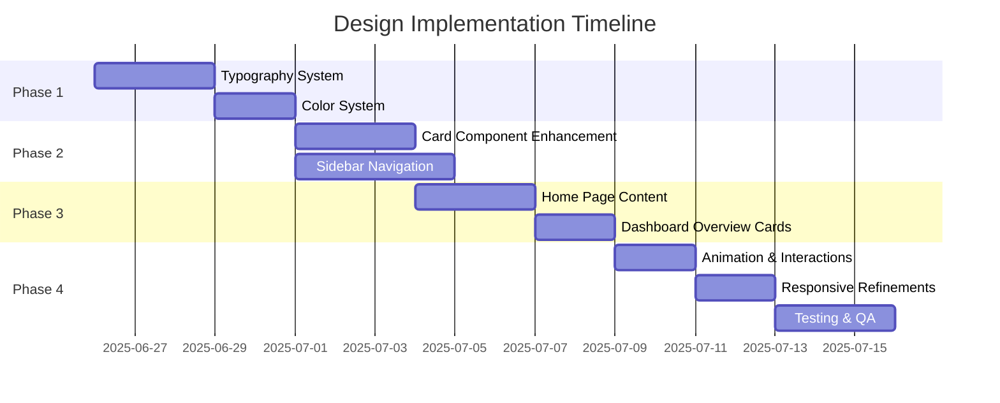

# Fortinet Network Visualizer Design Implementation Plan

## Introduction

This document serves as the main implementation plan for enhancing the Fortinet Network Visualizer interface based on the design enhancement guide. The goal is to transform the current functional interface into a more professional, modern, and visually appealing experience while maintaining technical clarity and usability.

## Current Design Assessment

The current design provides a solid foundation but lacks visual polish and sophistication:

- **Navigation**: Basic dark sidebar with plain text navigation items
- **Typography**: Limited visual hierarchy in text elements
- **Content Containers**: Simple cards without depth or visual distinction
- **Empty Space**: Large unused areas on the home page
- **Visual Elements**: Minimal use of shadows, gradients, and visual cues

## Enhancement Overview

The planned enhancements focus on three key areas, each with its own detailed implementation guide:

1. **Typography and Visual Hierarchy** - [typography-implementation-guide.md](./typography-implementation-guide.md)
   - Comprehensive typography system with proper sizing and weights
   - Improved text readability and professionalism
   - Better visual hierarchy through spacing and styling

2. **Sidebar Navigation** - [sidebar-enhancement-guide.md](./sidebar-enhancement-guide.md)
   - Enhanced visual depth with gradients and shadows
   - Improved active state indication
   - Better organization with section labels and separators
   - Refined footer with user information

3. **Content Containers and Empty Space** - [home-content-enhancement-guide.md](./home-content-enhancement-guide.md)
   - Enhanced card styling with proper shadows and borders
   - Dashboard overview cards showing key metrics
   - Recent activity and system status displays
   - Quick access links to frequently used sections

## Implementation Roadmap

Based on the design guide's prioritization and the user feedback, here is the recommended implementation order:



### Phase 1: Foundation (Days 1-5)

1. **Typography System** (3 days)
   - Implement CSS variables for typography
   - Create utility classes for text styling
   - Update page components to use new typography

2. **Color System** (2 days)
   - Implement color variables based on design guide
   - Apply color system to existing components
   - Ensure proper contrast and accessibility

### Phase 2: Core Components (Days 6-10)

3. **Card Component Enhancement** (3 days)
   - Improve card styling with shadows and borders
   - Enhance headers and content areas
   - Add hover states and interactions

4. **Sidebar Navigation** (4 days)
   - Implement enhanced sidebar design
   - Add active state indicators
   - Improve organization with sections
   - Refine footer area

### Phase 3: Content Development (Days 11-15)

5. **Home Page Content** (3 days)
   - Update main content area styling
   - Enhance text presentation
   - Improve spacing and layout

6. **Dashboard Overview Cards** (2 days)
   - Create dashboard card components
   - Implement grid layout
   - Add metrics and status indicators

### Phase 4: Refinement (Days 16-21)

7. **Animation & Interactions** (2 days)
   - Add subtle animations for transitions
   - Improve hover effects
   - Enhance interactive elements

8. **Responsive Refinements** (2 days)
   - Test and adjust layouts for all screen sizes
   - Ensure proper spacing at all breakpoints
   - Optimize for mobile devices

9. **Testing & QA** (3 days)
   - Cross-browser testing
   - Accessibility validation
   - Performance optimization

## Integration Approach

The implementation guides should be used together in the following manner:

1. **Start with Base Files**
   - First implement the CSS variables in `globals.css`
   - These variables will be referenced by all components

2. **Component Updates**
   - Update the core components using the new variables
   - Begin with typography updates as they affect all elements
   - Then move to sidebar and card enhancements

3. **Page-Level Updates**
   - Apply the enhanced components to the home page
   - Add new dashboard elements to utilize empty space
   - Implement animations and interactions

## CSS Organization

To maintain a clean and maintainable codebase, organize CSS as follows:

```
globals.css
├─ Variables
│  ├─ Typography
│  ├─ Colors
│  ├─ Spacing
│  ├─ Shadows
│  └─ Component-specific
├─ Base Styles
│  ├─ Typography utility classes
│  ├─ Layout utilities
│  └─ Animation definitions
└─ Global component styles
```

Component-specific styles should be kept with their respective components using CSS modules or styled components.

## Testing and Quality Assurance

For comprehensive quality assurance:

1. **Visual Testing**
   - Compare against design guidelines
   - Verify spacing, typography, and color usage
   - Ensure consistent styling across all pages

2. **Responsive Testing**
   - Test at standard breakpoints (1920px, 1440px, 1024px, 768px, 375px)
   - Verify that layouts adapt appropriately
   - Check for any overflow or layout issues

3. **Browser Testing**
   - Test in Chrome, Firefox, Safari, and Edge
   - Verify consistent rendering
   - Check for any browser-specific issues

4. **Accessibility Testing**
   - Verify WCAG AA compliance
   - Test with keyboard navigation
   - Check color contrast
   - Verify screen reader compatibility

5. **Performance Testing**
   - Measure rendering performance
   - Check animation smoothness
   - Verify no layout shifts during loading

## Conclusion

This implementation plan provides a structured approach to enhancing the Fortinet Network Visualizer interface. By following the detailed guides and implementation roadmap, the application will be transformed into a more professional, modern, and visually appealing experience while maintaining its technical clarity and usability.

The modular approach allows for incremental improvements, with each phase building upon the previous one. This ensures that progress can be made steadily, with visible improvements at each stage of the implementation.

## References

- [Typography Implementation Guide](./typography-implementation-guide.md)
- [Sidebar Enhancement Guide](./sidebar-enhancement-guide.md)
- [Home Content Enhancement Guide](./home-content-enhancement-guide.md)
- [Design Enhancement Guide](./design-enhancement-guide.md)