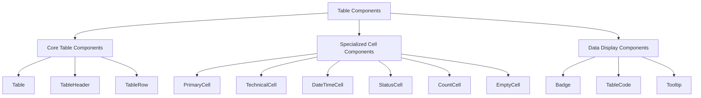

# Fortinet Network Visualizer - Table Standardization Plan

## Current Issues

After analyzing the table implementations across different pages (Firewalls, VDoms, Routes, Interfaces, VIPs, and Search Results), several inconsistencies have been identified:

### Visual Inconsistencies

1. **Table Cell Styling**
   - Inconsistent padding and spacing between cells
   - Different text alignment for similar data types (especially IP addresses)
   - Varying row heights across tables
   - Inconsistent handling of empty/null values

2. **Visual Elements**
   - Different badge styling for count indicators (VDoms, Routes, etc.)
   - Inconsistent status indicators (e.g., "unknown" badges have different styling)
   - Non-uniform link styling within tables
   - Varying use of icons (especially in datetime columns)

3. **Page Structure**
   - Filter sections have different layouts and spacing
   - Inconsistent pagination display
   - Varying header designs and typography
   - Different approaches to showing item counts

## Standardization Solution

### 1. Enhanced Component Architecture



### 2. Enhanced Table Cell Components

We'll expand the existing `table-cells.tsx` with standardized components:

```typescript
// Enhanced cell types
export type CellVariant = 
  | "primary"    // Entity names (bold)
  | "technical"  // IPs, ports, technical values (monospace)
  | "status"     // Status indicators
  | "count"      // Numerical counts with badges
  | "datetime"   // Timestamps
  | "empty";     // Standardized empty state
```

### 3. CSS Variable Standardization

We'll consolidate and standardize CSS variables in `globals.css`:

```css
/* Table-specific design tokens */
--table-row-height: 3.5rem;
--table-cell-padding-x: 1rem;
--table-cell-padding-y: 1rem;
--table-header-bg-start: #f8fafc;
--table-header-bg-end: #f1f5f9;
--table-row-border: #e2e8f0;
--table-row-hover-bg: rgba(241, 245, 249, 0.7);

/* Typography standardization */
--table-header-font-size: 0.75rem;
--table-header-font-weight: 600;
--table-header-letter-spacing: 0.05em;
--table-header-text-transform: uppercase;

--table-cell-font-size: 0.875rem;
--table-cell-line-height: 1.25rem;
--table-cell-primary-font-weight: 500;
--table-cell-primary-color: var(--text-primary);

/* Technical content styling */
--table-code-font-size: 0.875rem;
--table-code-bg: var(--muted);
--table-code-text-color: var(--text-primary);
--table-code-padding-x: 0.5rem;
--table-code-padding-y: 0.25rem;
--table-code-border-radius: 0.25rem;

/* Empty state standardization */
--table-empty-color: var(--muted-foreground);
```

## Implementation Guide

### 1. Standardized Table Cell Components

#### Core Cell Components

We will enhance the existing table cell components and add new ones to ensure consistency:

1. **PrimaryCell**: For entity names and primary identifiers
   - Bold font weight (500)
   - Primary text color
   - Left alignment

2. **TechnicalCell**: For IP addresses, ports, and technical data
   - Monospace font using TableCode
   - Standardized padding
   - Consistent handling of empty values

3. **StatusCell**: For status indicators
   - Consistent badge styling based on status type (success, warning, error, neutral)
   - Uniform size and padding
   - Clear visual distinction between states

4. **CountCell**: For numerical counts with badges
   - Standardized badge styling for count indicators
   - Consistent hover behavior for expandable counts
   - Uniform display of count numbers

5. **DateTimeCell**: For timestamps
   - Consistent date/time formatting
   - Uniform icon usage
   - Standardized tooltip for detailed timestamp

6. **EmptyCell**: For standardized empty state handling
   - Consistent display of null/undefined values
   - Uniform dash character and styling
   - Proper alignment with other cells

### 2. Table Header Standardization

All table headers will follow these guidelines:

- Uppercase text transformation
- 12px (0.75rem) font size
- 600 font weight
- 0.05em letter spacing
- Consistent color using `--muted-foreground`
- Standard gradient background from `--table-header-bg-start` to `--table-header-bg-end`
- Uniform padding: 1rem horizontal, 0.75rem vertical

### 3. Table Row Standardization

- Consistent row height of 3.5rem (56px)
- Uniform border style using `--table-row-border`
- Standardized hover state using `--table-row-hover-bg`
- Proper vertical alignment of all content

### 4. Filter Section Standardization

- Consistent layout for all filter sections
- Uniform styling for dropdowns and inputs
- Standardized "Apply Filter" and "Clear" buttons
- Proper spacing and alignment

### 5. Pagination Standardization

- Consistent pagination component across all tables
- Uniform "Showing X-Y of Z" text
- Standardized page navigation controls
- Proper alignment and spacing

## Implementation Checklist

1. Update `table-cells.tsx` with enhanced cell components
2. Standardize CSS variables in `globals.css`
3. Create a reusable filter section component
4. Standardize table headers across all pages
5. Update each page to use the standardized components
6. Implement consistent empty state handling
7. Standardize pagination display

## Example Implementations

### Standard Table Header

```tsx
<TableHeader>
  <TableRow>
    <TableHead>Name</TableHead>
    <TableHead>IP Address</TableHead>
    <TableHead>Status</TableHead>
    <TableHead className="text-right">Last Updated</TableHead>
  </TableRow>
</TableHeader>
```

### Standard Table Row

```tsx
<TableRow>
  <PrimaryCell>{item.name}</PrimaryCell>
  <TechnicalCell value={item.ipAddress} />
  <StatusCell status={item.status} statusText={item.statusText} />
  <DateTimeCell date={item.lastUpdated} />
</TableRow>
```

## Visual Design Reference

### Colors

- Primary Text: `var(--text-primary)` - Main text color
- Secondary Text: `var(--text-secondary)` - Less emphasized text
- Muted Text: `var(--muted-foreground)` - For hints and secondary information
- Technical Text Background: `var(--muted)` - Background for code/technical data
- Table Header Start: `var(--table-header-bg-start)` - Header gradient start
- Table Header End: `var(--table-header-bg-end)` - Header gradient end
- Row Border: `var(--table-row-border)` - Border between rows
- Row Hover: `var(--table-row-hover-bg)` - Background on row hover

### Status Colors

- Success: `var(--success)` - Green for positive status
- Warning: `var(--warning)` - Amber for warnings
- Error: `var(--error)` - Red for critical items
- Neutral: `var(--neutral)` - Gray for neutral/unknown status

## Benefits of Standardization

1. **Improved User Experience**
   - Consistent visual language across the application
   - Better readability and scanability of data
   - Clear visual hierarchy

2. **Developer Efficiency**
   - Reusable components reduce code duplication
   - Easier maintenance and updates
   - Faster implementation of new tables

3. **Visual Cohesion**
   - Professional and polished appearance
   - Brand consistency
   - Enhanced perceived quality of the application