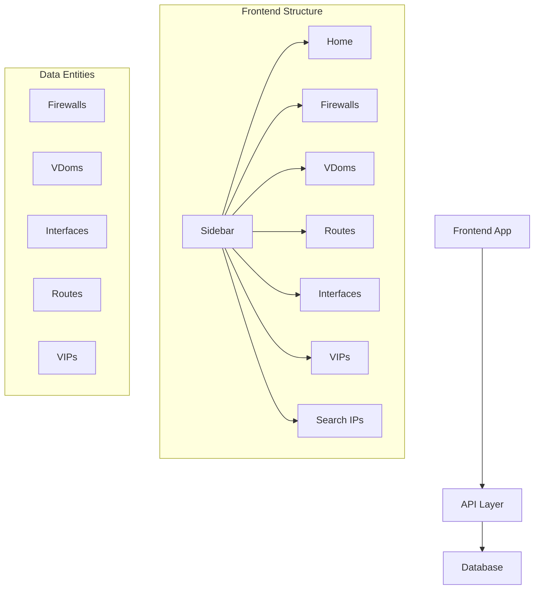

# Fortinet Web Application Implementation Plan

## Project Overview

This plan outlines the steps to enhance the Fortinet web application to display network information stored in a PostgreSQL database. The application will have a sidebar navigation and card-based layout using shadcn/ui components.



## 1. Project Setup and Dependencies

### 1.1 Install Required shadcn/ui Components

```bash
# Navigate to the project directory
cd fortinet-web

# Install shadcn/ui components mentioned in requirements
npx shadcn-ui@latest add sidebar
npx shadcn-ui@latest add card
npx shadcn-ui@latest add table
npx shadcn-ui@latest add hover-card
npx shadcn-ui@latest add badge
npx shadcn-ui@latest add combobox
npx shadcn-ui@latest add label
npx shadcn-ui@latest add pagination
npx shadcn-ui@latest add tabs
npx shadcn-ui@latest add tooltip
npx shadcn-ui@latest add input
npx shadcn-ui@latest add button
npx shadcn-ui@latest add breadcrumb
npx shadcn-ui@latest add popover
npx shadcn-ui@latest add skeleton
npx shadcn-ui@latest add progress
npx shadcn-ui@latest add scroll-area
```

### 1.2 Create API Service Layer

Create services to fetch data from the API endpoints:

```typescript
// services/api.ts
import { FirewallResponse, VDOMResponse, InterfaceResponse, RouteResponse, VIPResponse } from '../types';

const API_BASE_URL = process.env.NEXT_PUBLIC_API_URL || 'http://localhost:8000';

export async function getFirewalls(params?: Record<string, string>): Promise<FirewallResponse[]> {
  const queryParams = params ? new URLSearchParams(params).toString() : '';
  const url = `${API_BASE_URL}/firewalls/${queryParams ? `?${queryParams}` : ''}`;
  const response = await fetch(url);
  if (!response.ok) throw new Error('Failed to fetch firewalls');
  return response.json();
}

export async function getVdoms(params?: Record<string, string>): Promise<VDOMResponse[]> {
  const queryParams = params ? new URLSearchParams(params).toString() : '';
  const url = `${API_BASE_URL}/vdoms/${queryParams ? `?${queryParams}` : ''}`;
  const response = await fetch(url);
  if (!response.ok) throw new Error('Failed to fetch vdoms');
  return response.json();
}

export async function getInterfaces(params?: Record<string, string>): Promise<InterfaceResponse[]> {
  const queryParams = params ? new URLSearchParams(params).toString() : '';
  const url = `${API_BASE_URL}/interfaces/${queryParams ? `?${queryParams}` : ''}`;
  const response = await fetch(url);
  if (!response.ok) throw new Error('Failed to fetch interfaces');
  return response.json();
}

export async function getRoutes(params?: Record<string, string>): Promise<RouteResponse[]> {
  const queryParams = params ? new URLSearchParams(params).toString() : '';
  const url = `${API_BASE_URL}/routes/${queryParams ? `?${queryParams}` : ''}`;
  const response = await fetch(url);
  if (!response.ok) throw new Error('Failed to fetch routes');
  return response.json();
}

export async function getVips(params?: Record<string, string>): Promise<VIPResponse[]> {
  const queryParams = params ? new URLSearchParams(params).toString() : '';
  const url = `${API_BASE_URL}/vips/${queryParams ? `?${queryParams}` : ''}`;
  const response = await fetch(url);
  if (!response.ok) throw new Error('Failed to fetch vips');
  return response.json();
}

export async function searchIPs(query: string): Promise<{
  interfaces: InterfaceResponse[];
  routes: RouteResponse[];
  vips: VIPResponse[];
}> {
  const response = await fetch(`${API_BASE_URL}/search/ip?query=${encodeURIComponent(query)}`);
  if (!response.ok) throw new Error('Failed to search IPs');
  return response.json();
}
```

### 1.3 Create Type Definitions

```typescript
// types/index.ts
export interface FirewallResponse {
  firewall_id: number;
  fw_name: string;
  fw_ip: string;
  fmg_ip?: string;
  faz_ip?: string;
  site?: string;
  last_updated: string;
}

export interface VDOMResponse {
  vdom_id: number;
  firewall_id: number;
  vdom_name: string;
  vdom_index?: number;
  last_updated: string;
  firewall?: FirewallResponse;
}

export interface InterfaceResponse {
  interface_id: number;
  firewall_id: number;
  vdom_id?: number;
  interface_name: string;
  ip_address?: string;
  mask?: string;
  type: string;
  vlan_id?: number;
  description?: string;
  status?: string;
  physical_interface_name?: string;
  last_updated: string;
  vdom?: VDOMResponse;
}

export interface RouteResponse {
  route_id: number;
  vdom_id: number;
  destination_network: string;
  mask_length: number;
  route_type: string;
  gateway?: string;
  exit_interface_name: string;
  exit_interface_details?: string;
  last_updated: string;
  vdom?: VDOMResponse;
}

export interface VIPResponse {
  vip_id: number;
  vdom_id: number;
  external_ip: string;
  external_port?: number;
  mapped_ip: string;
  mapped_port?: number;
  vip_type?: string;
  external_interface?: string;
  mask?: number;
  last_updated: string;
  vdom?: VDOMResponse;
}
```

## 2. Layout and Navigation Components

### 2.1 Update Layout Component

```tsx
// app/layout.tsx
import type { Metadata } from "next";
import { Geist, Geist_Mono } from "next/font/google";
import "./globals.css";
import { AppSidebar } from "@/components/app-sidebar";

const geistSans = Geist({
  variable: "--font-geist-sans",
  subsets: ["latin"],
});

const geistMono = Geist_Mono({
  variable: "--font-geist-mono",
  subsets: ["latin"],
});

export const metadata: Metadata = {
  title: "Fortinet Network Visualizer",
  description: "A visual interface for Fortinet network configuration data",
};

export default function RootLayout({
  children,
}: Readonly<{
  children: React.ReactNode;
}>) {
  return (
    <html lang="en">
      <body
        className={`${geistSans.variable} ${geistMono.variable} antialiased`}
      >
        <div className="flex h-screen">
          <AppSidebar />
          <main className="flex-1 p-6 overflow-auto">
            {children}
          </main>
        </div>
      </body>
    </html>
  );
}
```

### 2.2 Create Sidebar Component

```tsx
// components/app-sidebar.tsx
"use client"

import Link from "next/link";
import { usePathname } from "next/navigation";
import { cn } from "@/lib/utils";
import { Button } from "@/components/ui/button";
import { ScrollArea } from "@/components/ui/scroll-area";

export function AppSidebar() {
  const pathname = usePathname();

  const routes = [
    {
      name: "Home",
      path: "/",
    },
    {
      name: "Firewalls",
      path: "/firewalls",
    },
    {
      name: "Vdoms",
      path: "/vdoms",
    },
    {
      name: "Routes",
      path: "/routes",
    },
    {
      name: "Interfaces",
      path: "/interfaces",
    },
    {
      name: "Vips",
      path: "/vips",
    },
    {
      name: "Search IPs",
      path: "/search-ips",
    },
  ];

  return (
    <div className="w-64 border-r bg-background h-screen">
      <div className="h-16 flex items-center px-4 border-b">
        <Link href="/" className="font-semibold text-lg">
          Fortinet Network Visualizer
        </Link>
      </div>
      <ScrollArea className="h-[calc(100vh-4rem)]">
        <nav className="p-2 space-y-2">
          {routes.map((route) => (
            <Link
              key={route.path}
              href={route.path}
              className="block"
            >
              <Button
                variant={pathname === route.path ? "secondary" : "ghost"}
                className={cn(
                  "w-full justify-start",
                  pathname === route.path && "font-medium"
                )}
              >
                {route.name}
              </Button>
            </Link>
          ))}
        </nav>
      </ScrollArea>
    </div>
  );
}
```

## 3. Page Components Implementation

### 3.1 Home Page

```tsx
// app/page.tsx
import { Card, CardContent, CardDescription, CardHeader, CardTitle } from "@/components/ui/card";

export default function Home() {
  return (
    <div className="space-y-6">
      <h1 className="text-3xl font-bold">Welcome to Fortinet Network Visualizer</h1>
      
      <Card className="w-full max-w-4xl">
        <CardHeader>
          <CardTitle>Project Overview</CardTitle>
          <CardDescription>A visual interface for Fortinet network configuration data</CardDescription>
        </CardHeader>
        <CardContent className="space-y-4">
          <p>
            This application connects to Fortinet devices, parses network-specific information, 
            and stores them in a PostgreSQL database. The information is then retrieved through 
            an API and displayed by this front-end application.
          </p>
          
          <h3 className="text-lg font-semibold mt-4">Features</h3>
          <ul className="list-disc pl-6 space-y-2">
            <li>View and filter firewall devices</li>
            <li>Browse VDoms and their associated configurations</li>
            <li>Explore routing tables with filtering options</li>
            <li>Inspect network interfaces with status indicators</li>
            <li>Review Virtual IP configurations</li>
            <li>Advanced IP address search functionality</li>
          </ul>
          
          <p className="mt-4">
            Use the sidebar navigation to explore different sections of the application.
          </p>
        </CardContent>
      </Card>
    </div>
  );
}
```

### 3.2 Firewalls Page

```tsx
// app/firewalls/page.tsx
import { Card, CardContent, CardDescription, CardHeader, CardTitle } from "@/components/ui/card";
import { Table, TableBody, TableCell, TableHead, TableHeader, TableRow } from "@/components/ui/table";
import { HoverCard, HoverCardContent, HoverCardTrigger } from "@/components/ui/hover-card";
import { DataPagination } from "@/components/data-pagination";
import { FirewallsFilter } from "./components/firewalls-filter";
import { getFirewalls, getVdoms } from "@/services/api";

export default async function FirewallsPage({ 
  searchParams 
}: { 
  searchParams: { fw_name?: string; page?: string; pageSize?: string } 
}) {
  // Extract pagination params
  const page = searchParams.page ? parseInt(searchParams.page) : 1;
  const pageSize = searchParams.pageSize ? parseInt(searchParams.pageSize) : 15;
  
  // Extract filter params
  const fw_name = searchParams.fw_name;
  
  // Build filter object
  const filters: Record<string, string> = {};
  if (fw_name) filters.fw_name = fw_name;
  
  // Add pagination params
  filters.skip = ((page - 1) * pageSize).toString();
  filters.limit = pageSize.toString();
  
  // Fetch data with filters
  const firewalls = await getFirewalls(filters);
  
  // In a real app, we'd also fetch total count for pagination
  const totalCount = 100; // Placeholder, should come from API
  const totalPages = Math.ceil(totalCount / pageSize);
  
  return (
    <div className="space-y-6">
      <h1 className="text-3xl font-bold">Firewalls</h1>
      
      <Card>
        <CardHeader>
          <CardTitle>Filter Options</CardTitle>
        </CardHeader>
        <CardContent>
          <FirewallsFilter initialFirewallName={fw_name} />
        </CardContent>
      </Card>
      
      <Card>
        <CardHeader>
          <CardTitle>Firewall Devices</CardTitle>
          <CardDescription>List of managed Fortinet firewall devices</CardDescription>
        </CardHeader>
        <CardContent>
          <Table>
            <TableHeader>
              <TableRow>
                <TableHead>Firewall Name</TableHead>
                <TableHead>IP Address</TableHead>
                <TableHead>FortiManager IP</TableHead>
                <TableHead>FortiAnalyzer IP</TableHead>
                <TableHead>VDoms</TableHead>
                <TableHead>Last Updated</TableHead>
              </TableRow>
            </TableHeader>
            <TableBody>
              {firewalls.map((firewall) => (
                <TableRow key={firewall.firewall_id}>
                  <TableCell>{firewall.fw_name}</TableCell>
                  <TableCell>{firewall.fw_ip}</TableCell>
                  <TableCell>{firewall.fmg_ip || '-'}</TableCell>
                  <TableCell>{firewall.faz_ip || '-'}</TableCell>
                  <TableCell>
                    <HoverCard>
                      <HoverCardTrigger asChild>
                        <span className="cursor-help underline">View VDoms</span>
                      </HoverCardTrigger>
                      <HoverCardContent className="w-80">
                        <VdomsList firewallId={firewall.firewall_id} />
                      </HoverCardContent>
                    </HoverCard>
                  </TableCell>
                  <TableCell>{new Date(firewall.last_updated).toLocaleString()}</TableCell>
                </TableRow>
              ))}
            </TableBody>
          </Table>
          
          <div className="mt-4 flex justify-center">
            <DataPagination currentPage={page} totalPages={totalPages} />
          </div>
        </CardContent>
      </Card>
    </div>
  );
}

async function VdomsList({ firewallId }: { firewallId: number }) {
  const vdoms = await getVdoms({ firewall_id: firewallId.toString() });
  
  return (
    <div className="space-y-2">
      <h4 className="font-semibold">VDoms</h4>
      <ul className="list-disc pl-4">
        {vdoms.length > 0 ? (
          vdoms.map((vdom) => (
            <li key={vdom.vdom_id}>{vdom.vdom_name}</li>
          ))
        ) : (
          <li>No VDoms found</li>
        )}
      </ul>
    </div>
  );
}
```

### 3.3 VDoms Page

```tsx
// app/vdoms/page.tsx
import { Card, CardContent, CardDescription, CardHeader, CardTitle } from "@/components/ui/card";
import { Table, TableBody, TableCell, TableHead, TableHeader, TableRow } from "@/components/ui/table";
import { HoverCard, HoverCardContent, HoverCardTrigger } from "@/components/ui/hover-card";
import { DataPagination } from "@/components/data-pagination";
import { VdomsFilter } from "./components/vdoms-filter";
import { getVdoms, getFirewalls, getInterfaces, getRoutes, getVips } from "@/services/api";

export default async function VdomsPage({ 
  searchParams 
}: { 
  searchParams: { fw_name?: string; vdom_name?: string; page?: string; pageSize?: string } 
}) {
  // Extract pagination params
  const page = searchParams.page ? parseInt(searchParams.page) : 1;
  const pageSize = searchParams.pageSize ? parseInt(searchParams.pageSize) : 15;
  
  // Extract filter params
  const fw_name = searchParams.fw_name;
  const vdom_name = searchParams.vdom_name;
  
  // Build filter object
  const filters: Record<string, string> = {};
  if (fw_name) filters.fw_name = fw_name;
  if (vdom_name) filters.vdom_name = vdom_name;
  
  // Add pagination params
  filters.skip = ((page - 1) * pageSize).toString();
  filters.limit = pageSize.toString();
  
  // Fetch data with filters
  const vdoms = await getVdoms(filters);
  const firewalls = await getFirewalls();
  
  // In a real app, we'd also fetch total count for pagination
  const totalCount = 100; // Placeholder, should come from API
  const totalPages = Math.ceil(totalCount / pageSize);
  
  return (
    <div className="space-y-6">
      <h1 className="text-3xl font-bold">VDoms</h1>
      
      <Card>
        <CardHeader>
          <CardTitle>Filter Options</CardTitle>
        </CardHeader>
        <CardContent>
          <VdomsFilter firewalls={firewalls} initialFwName={fw_name} initialVdomName={vdom_name} />
        </CardContent>
      </Card>
      
      <Card>
        <CardHeader>
          <CardTitle>VDom List</CardTitle>
          <CardDescription>Virtual domains across firewall devices</CardDescription>
        </CardHeader>
        <CardContent>
          <Table>
            <TableHeader>
              <TableRow>
                <TableHead>VDom Name</TableHead>
                <TableHead>Firewall</TableHead>
                <TableHead>Interfaces</TableHead>
                <TableHead>VIPs</TableHead>
                <TableHead>Routes</TableHead>
                <TableHead>Last Updated</TableHead>
              </TableRow>
            </TableHeader>
            <TableBody>
              {vdoms.map((vdom) => (
                <TableRow key={vdom.vdom_id}>
                  <TableCell>{vdom.vdom_name}</TableCell>
                  <TableCell>{vdom.firewall?.fw_name || '-'}</TableCell>
                  <TableCell>
                    <HoverCard>
                      <HoverCardTrigger asChild>
                        <span className="cursor-help underline">View Interfaces</span>
                      </HoverCardTrigger>
                      <HoverCardContent className="w-80">
                        <InterfacesList vdomId={vdom.vdom_id} />
                      </HoverCardContent>
                    </HoverCard>
                  </TableCell>
                  <TableCell>
                    <HoverCard>
                      <HoverCardTrigger asChild>
                        <span className="cursor-help underline">View VIPs</span>
                      </HoverCardTrigger>
                      <HoverCardContent className="w-80">
                        <VipsList vdomId={vdom.vdom_id} />
                      </HoverCardContent>
                    </HoverCard>
                  </TableCell>
                  <TableCell>
                    <HoverCard>
                      <HoverCardTrigger asChild>
                        <span className="cursor-help underline">View Routes</span>
                      </HoverCardTrigger>
                      <HoverCardContent className="w-80">
                        <RoutesList vdomId={vdom.vdom_id} />
                      </HoverCardContent>
                    </HoverCard>
                  </TableCell>
                  <TableCell>{new Date(vdom.last_updated).toLocaleString()}</TableCell>
                </TableRow>
              ))}
            </TableBody>
          </Table>
          
          <div className="mt-4 flex justify-center">
            <DataPagination currentPage={page} totalPages={totalPages} />
          </div>
        </CardContent>
      </Card>
    </div>
  );
}

async function InterfacesList({ vdomId }: { vdomId: number }) {
  const interfaces = await getInterfaces({ vdom_id: vdomId.toString() });
  
  return (
    <div className="space-y-2">
      <h4 className="font-semibold">Interfaces</h4>
      <ul className="list-disc pl-4">
        {interfaces.length > 0 ? (
          interfaces.map((iface) => (
            <li key={iface.interface_id}>
              {iface.interface_name} - {iface.ip_address || 'No IP'}
            </li>
          ))
        ) : (
          <li>No interfaces found</li>
        )}
      </ul>
    </div>
  );
}

async function VipsList({ vdomId }: { vdomId: number }) {
  const vips = await getVips({ vdom_id: vdomId.toString() });
  
  return (
    <div className="space-y-2">
      <h4 className="font-semibold">VIPs</h4>
      <ul className="list-disc pl-4">
        {vips.length > 0 ? (
          vips.map((vip) => (
            <li key={vip.vip_id}>
              {vip.external_ip} → {vip.mapped_ip}
            </li>
          ))
        ) : (
          <li>No VIPs found</li>
        )}
      </ul>
    </div>
  );
}

async function RoutesList({ vdomId }: { vdomId: number }) {
  const routes = await getRoutes({ vdom_id: vdomId.toString() });
  
  return (
    <div className="space-y-2">
      <h4 className="font-semibold">Routes</h4>
      <ul className="list-disc pl-4">
        {routes.length > 0 ? (
          routes.map((route) => (
            <li key={route.route_id}>
              {route.destination_network}/{route.mask_length} via {route.gateway || route.exit_interface_name}
            </li>
          ))
        ) : (
          <li>No routes found</li>
        )}
      </ul>
    </div>
  );
}
```

### 3.4 Routes Page

```tsx
// app/routes/page.tsx
import { Card, CardContent, CardDescription, CardHeader, CardTitle } from "@/components/ui/card";
import { Table, TableBody, TableCell, TableHead, TableHeader, TableRow } from "@/components/ui/table";
import { DataPagination } from "@/components/data-pagination";
import { RoutesFilter } from "./components/routes-filter";
import { getRoutes, getVdoms } from "@/services/api";

export default async function RoutesPage({ 
  searchParams 
}: { 
  searchParams: { vdom_name?: string; page?: string; pageSize?: string } 
}) {
  // Extract pagination params
  const page = searchParams.page ? parseInt(searchParams.page) : 1;
  const pageSize = searchParams.pageSize ? parseInt(searchParams.pageSize) : 15;
  
  // Extract filter params
  const vdom_name = searchParams.vdom_name;
  
  // Build filter object
  const filters: Record<string, string> = {};
  if (vdom_name) filters.vdom_name = vdom_name;
  
  // Add pagination params
  filters.skip = ((page - 1) * pageSize).toString();
  filters.limit = pageSize.toString();
  
  // Fetch data with filters
  const routes = await getRoutes(filters);
  const vdoms = await getVdoms();
  
  // In a real app, we'd also fetch total count for pagination
  const totalCount = 100; // Placeholder, should come from API
  const totalPages = Math.ceil(totalCount / pageSize);
  
  return (
    <div className="space-y-6">
      <h1 className="text-3xl font-bold">Routes</h1>
      
      <Card>
        <CardHeader>
          <CardTitle>Filter Options</CardTitle>
        </CardHeader>
        <CardContent>
          <RoutesFilter vdoms={vdoms} initialVdomName={vdom_name} />
        </CardContent>
      </Card>
      
      <Card>
        <CardHeader>
          <CardTitle>Routing Table</CardTitle>
          <CardDescription>Network routes across all firewalls</CardDescription>
        </CardHeader>
        <CardContent>
          <Table>
            <TableHeader>
              <TableRow>
                <TableHead>Route Type</TableHead>
                <TableHead>Destination</TableHead>
                <TableHead>Gateway</TableHead>
                <TableHead>Exit Interface</TableHead>
                <TableHead>VDom</TableHead>
                <TableHead>Last Updated</TableHead>
              </TableRow>
            </TableHeader>
            <TableBody>
              {routes.map((route) => (
                <TableRow key={route.route_id}>
                  <TableCell>{route.route_type}</TableCell>
                  <TableCell>{route.destination_network}/{route.mask_length}</TableCell>
                  <TableCell>{route.gateway || '-'}</TableCell>
                  <TableCell>{route.exit_interface_name}</TableCell>
                  <TableCell>{route.vdom?.vdom_name || '-'}</TableCell>
                  <TableCell>{new Date(route.last_updated).toLocaleString()}</TableCell>
                </TableRow>
              ))}
            </TableBody>
          </Table>
          
          <div className="mt-4 flex justify-center">
            <DataPagination currentPage={page} totalPages={totalPages} />
          </div>
        </CardContent>
      </Card>
    </div>
  );
}
```

### 3.5 Interfaces Page

```tsx
// app/interfaces/page.tsx
import { Card, CardContent, CardDescription, CardHeader, CardTitle } from "@/components/ui/card";
import { Table, TableBody, TableCell, TableHead, TableHeader, TableRow } from "@/components/ui/table";
import { Badge } from "@/components/ui/badge";
import { DataPagination } from "@/components/data-pagination";
import { InterfacesFilter } from "./components/interfaces-filter";
import { getInterfaces, getVdoms } from "@/services/api";

export default async function InterfacesPage({ 
  searchParams 
}: { 
  searchParams: { vdom_name?: string; page?: string; pageSize?: string } 
}) {
  // Extract pagination params
  const page = searchParams.page ? parseInt(searchParams.page) : 1;
  const pageSize = searchParams.pageSize ? parseInt(searchParams.pageSize) : 15;
  
  // Extract filter params
  const vdom_name = searchParams.vdom_name;
  
  // Build filter object
  const filters: Record<string, string> = {};
  if (vdom_name) filters.vdom_name = vdom_name;
  
  // Add pagination params
  filters.skip = ((page - 1) * pageSize).toString();
  filters.limit = pageSize.toString();
  
  // Fetch data with filters
  const interfaces = await getInterfaces(filters);
  const vdoms = await getVdoms();
  
  // In a real app, we'd also fetch total count for pagination
  const totalCount = 100; // Placeholder, should come from API
  const totalPages = Math.ceil(totalCount / pageSize);
  
  return (
    <div className="space-y-6">
      <h1 className="text-3xl font-bold">Interfaces</h1>
      
      <Card>
        <CardHeader>
          <CardTitle>Filter Options</CardTitle>
        </CardHeader>
        <CardContent>
          <InterfacesFilter vdoms={vdoms} initialVdomName={vdom_name} />
        </CardContent>
      </Card>
      
      <Card>
        <CardHeader>
          <CardTitle>Network Interfaces</CardTitle>
          <CardDescription>Interfaces across all firewall devices</CardDescription>
        </CardHeader>
        <CardContent>
          <Table>
            <TableHeader>
              <TableRow>
                <TableHead>Interface Name</TableHead>
                <TableHead>IP Address/Mask</TableHead>
                <TableHead>Type</TableHead>
                <TableHead>VDom</TableHead>
                <TableHead>Status</TableHead>
                <TableHead>Last Updated</TableHead>
              </TableRow>
            </TableHeader>
            <TableBody>
              {interfaces.map((iface) => (
                <TableRow key={iface.interface_id}>
                  <TableCell>{iface.interface_name}</TableCell>
                  <TableCell>
                    {iface.ip_address && iface.mask ? `${iface.ip_address}/${iface.mask}` : '-'}
                  </TableCell>
                  <TableCell>{iface.type}</TableCell>
                  <TableCell>{iface.vdom?.vdom_name || 'Global'}</TableCell>
                  <TableCell>
                    {iface.status && (
                      <Badge variant={iface.status.toLowerCase() === 'up' ? 'success' : 'destructive'}>
                        {iface.status}
                      </Badge>
                    )}
                  </TableCell>
                  <TableCell>{new Date(iface.last_updated).toLocaleString()}</TableCell>
                </TableRow>
              ))}
            </TableBody>
          </Table>
          
          <div className="mt-4 flex justify-center">
            <DataPagination currentPage={page} totalPages={totalPages} />
          </div>
        </CardContent>
      </Card>
    </div>
  );
}
```

### 3.6 VIPs Page

```tsx
// app/vips/page.tsx
import { Card, CardContent, CardDescription, CardHeader, CardTitle } from "@/components/ui/card";
import { Table, TableBody, TableCell, TableHead, TableHeader, TableRow } from "@/components/ui/table";
import { DataPagination } from "@/components/data-pagination";
import { VipsFilter } from "./components/vips-filter";
import { getVips, getVdoms } from "@/services/api";

export default async function VipsPage({ 
  searchParams 
}: { 
  searchParams: { vdom_name?: string; page?: string; pageSize?: string } 
}) {
  // Extract pagination params
  const page = searchParams.page ? parseInt(searchParams.page) : 1;
  const pageSize = searchParams.pageSize ? parseInt(searchParams.pageSize) : 15;
  
  // Extract filter params
  const vdom_name = searchParams.vdom_name;
  
  // Build filter object
  const filters: Record<string, string> = {};
  if (vdom_name) filters.vdom_name = vdom_name;
  
  // Add pagination params
  filters.skip = ((page - 1) * pageSize).toString();
  filters.limit = pageSize.toString();
  
  // Fetch data with filters
  const vips = await getVips(filters);
  const vdoms = await getVdoms();
  
  // In a real app, we'd also fetch total count for pagination
  const totalCount = 100; // Placeholder, should come from API
  const totalPages = Math.ceil(totalCount / pageSize);
  
  return (
    <div className="space-y-6">
      <h1 className="text-3xl font-bold">Virtual IPs</h1>
      
      <Card>
        <CardHeader>
          <CardTitle>Filter Options</CardTitle>
        </CardHeader>
        <CardContent>
          <VipsFilter vdoms={vdoms} initialVdomName={vdom_name} />
        </CardContent>
      </Card>
      
      <Card>
        <CardHeader>
          <CardTitle>VIP Configuration</CardTitle>
          <CardDescription>Virtual IP mappings across all firewalls</CardDescription>
        </CardHeader>
        <CardContent>
          <Table>
            <TableHeader>
              <TableRow>
                <TableHead>External IP/Mask</TableHead>
                <TableHead>External Port</TableHead>
                <TableHead>Mapped IP</TableHead>
                <TableHead>Mapped Port</TableHead>
                <TableHead>VIP Type</TableHead>
                <TableHead>VDom</TableHead>
                <TableHead>Last Updated</TableHead>
              </TableRow>
            </TableHeader>
            <TableBody>
              {vips.map((vip) => (
                <TableRow key={vip.vip_id}>
                  <TableCell>
                    {vip.external_ip}{vip.mask ? `/${vip.mask}` : ''}
                  </TableCell>
                  <TableCell>{vip.external_port || '-'}</TableCell>
                  <TableCell>{vip.mapped_ip}</TableCell>
                  <TableCell>{vip.mapped_port || '-'}</TableCell>
                  <TableCell>{vip.vip_type || '-'}</TableCell>
                  <TableCell>{vip.vdom?.vdom_name || '-'}</TableCell>
                  <TableCell>{new Date(vip.last_updated).toLocaleString()}</TableCell>
                </TableRow>
              ))}
            </TableBody>
          </Table>
          
          <div className="mt-4 flex justify-center">
            <DataPagination currentPage={page} totalPages={totalPages} />
          </div>
        </CardContent>
      </Card>
    </div>
  );
}
```

### 3.7 Search IPs Page

```tsx
// app/search-ips/page.tsx
import { Card, CardContent, CardDescription, CardHeader, CardTitle } from "@/components/ui/card";
import { IPSearchForm } from "./components/ip-search-form";

export default function SearchIPsPage() {
  return (
    <div className="space-y-6">
      <h1 className="text-3xl font-bold">IP Address Search</h1>
      
      <Card>
        <CardHeader>
          <CardTitle>Search for IP Addresses</CardTitle>
          <CardDescription>
            Search across interfaces, routes, and VIPs using various IP formats
          </CardDescription>
        </CardHeader>
        <CardContent>
          <IPSearchForm />
        </CardContent>
      </Card>
    </div>
  );
}
```

## 4. Reusable Components

### 4.1 Filter Components

For each view, we'll need filtering components that use the shadcn/ui Combobox:

```tsx
// app/firewalls/components/firewalls-filter.tsx
"use client"

import { useState, useEffect } from "react";
import { useRouter, usePathname, useSearchParams } from "next/navigation";
import { Label } from "@/components/ui/label";
import { 
  Combobox,
  ComboboxTrigger,
  ComboboxInput,
  ComboboxContent,
  ComboboxItem
} from "@/components/ui/combobox";
import { Button } from "@/components/ui/button";
import { getFirewalls } from "@/services/api";

interface FirewallsFilterProps {
  initialFirewallName?: string;
}

export function FirewallsFilter({ initialFirewallName }: FirewallsFilterProps) {
  const router = useRouter();
  const pathname = usePathname();
  const searchParams = useSearchParams();
  
  const [firewallName, setFirewallName] = useState<string>(initialFirewallName || "");
  const [firewallOptions, setFirewallOptions] = useState<{ label: string; value: string }[]>([]);
  const [loading, setLoading] = useState(false);
  
  useEffect(() => {
    async function loadFirewallOptions() {
      setLoading(true);
      try {
        const firewalls = await getFirewalls();
        const options = firewalls.map(fw => ({
          label: fw.fw_name,
          value: fw.fw_name
        }));
        setFirewallOptions(options);
      } catch (error) {
        console.error("Failed to load firewall options:", error);
      } finally {
        setLoading(false);
      }
    }
    
    loadFirewallOptions();
  }, []);
  
  function handleFilterChange(value: string) {
    setFirewallName(value);
  }
  
  function handleApplyFilter() {
    const params = new URLSearchParams(searchParams);
    
    if (firewallName) {
      params.set("fw_name", firewallName);
    } else {
      params.delete("fw_name");
    }
    
    // Reset to page 1 when filter changes
    params.set("page", "1");
    
    router.push(`${pathname}?${params.toString()}`);
  }
  
  function handleClearFilter() {
    setFirewallName("");
    const params = new URLSearchParams(searchParams);
    params.delete("fw_name");
    params.set("page", "1");
    router.push(`${pathname}?${params.toString()}`);
  }
  
  return (
    <div className="flex flex-wrap items-end gap-4">
      <div className="grid gap-2">
        <Label htmlFor="fw-name">Firewall Name</Label>
        <Combobox value={firewallName} onValueChange={handleFilterChange}>
          <ComboboxTrigger className="w-[250px]">
            <ComboboxInput 
              id="fw-name"
              placeholder={loading ? "Loading..." : "Select firewall..."}
              disabled={loading}
            />
          </ComboboxTrigger>
          <ComboboxContent>
            {firewallOptions.map((option) => (
              <ComboboxItem key={option.value} value={option.value}>
                {option.label}
              </ComboboxItem>
            ))}
          </ComboboxContent>
        </Combobox>
      </div>
      
      <div className="flex gap-2">
        <Button onClick={handleApplyFilter}>Apply Filter</Button>
        <Button variant="outline" onClick={handleClearFilter}>Clear</Button>
      </div>
    </div>
  );
}
```

### 4.2 IP Search Components

A more complex component for the IP search functionality:

```tsx
// app/search-ips/components/ip-search-form.tsx
"use client"

import { useState } from "react";
import { Label } from "@/components/ui/label";
import { Input } from "@/components/ui/input";
import { Button } from "@/components/ui/button";
import { Tooltip, TooltipContent, TooltipProvider, TooltipTrigger } from "@/components/ui/tooltip";
import { Tabs, TabsContent, TabsList, TabsTrigger } from "@/components/ui/tabs";
import { Card, CardContent } from "@/components/ui/card";
import { searchIPs } from "@/services/api";
import { InterfaceResponse, RouteResponse, VIPResponse } from "@/types";
import { InterfaceResults, RouteResults, VipResults } from "./search-results";

export function IPSearchForm() {
  const [query, setQuery] = useState("");
  const [loading, setLoading] = useState(false);
  const [results, setResults] = useState<{
    interfaces: InterfaceResponse[];
    routes: RouteResponse[];
    vips: VIPResponse[];
  } | null>(null);
  
  async function handleSearch(e: React.FormEvent) {
    e.preventDefault();
    
    if (!query) return;
    
    setLoading(true);
    try {
      const searchResults = await searchIPs(query);
      setResults(searchResults);
    } catch (error) {
      console.error("Error searching IPs:", error);
    } finally {
      setLoading(false);
    }
  }
  
  return (
    <div className="space-y-6">
      <form onSubmit={handleSearch} className="flex flex-wrap items-end gap-4">
        <div className="grid flex-1 gap-2">
          <Label htmlFor="ip-search">Search for IP:</Label>
          <TooltipProvider>
            <Tooltip>
              <TooltipTrigger asChild>
                <Input
                  id="ip-search"
                  placeholder="e.g. 172.25 or 192.168.1.0/24"
                  value={query}
                  onChange={(e) => setQuery(e.target.value)}
                />
              </TooltipTrigger>
              <TooltipContent className="max-w-sm">
                <p>Search formats:</p>
                <ul className="list-disc pl-4 text-sm">
                  <li>Partial octet prefix (e.g., 172)</li>
                  <li>Partial IP (e.g., 172.25)</li>
                  <li>Full IP address (e.g., 172.25.10.1)</li>
                  <li>CIDR subnet (e.g., 172.25.10.0/24)</li>
                  <li>Host with CIDR mask (e.g., 172.25.10.1/32)</li>
                </ul>
              </TooltipContent>
            </Tooltip>
          </TooltipProvider>
        </div>
        <Button type="submit" disabled={loading}>
          {loading ? "Searching..." : "Search"}
        </Button>
      </form>
      
      {results && (
        <Tabs defaultValue="interfaces">
          <TabsList className="w-full">
            <TabsTrigger value="interfaces" className="flex-1">
              Interfaces ({results.interfaces.length})
            </TabsTrigger>
            <TabsTrigger value="routes" className="flex-1">
              Routes ({results.routes.length})
            </TabsTrigger>
            <TabsTrigger value="vips" className="flex-1">
              VIPs ({results.vips.length})
            </TabsTrigger>
          </TabsList>
          
          <TabsContent value="interfaces">
            <Card>
              <CardContent className="pt-6">
                <InterfaceResults interfaces={results.interfaces} />
              </CardContent>
            </Card>
          </TabsContent>
          
          <TabsContent value="routes">
            <Card>
              <CardContent className="pt-6">
                <RouteResults routes={results.routes} />
              </CardContent>
            </Card>
          </TabsContent>
          
          <TabsContent value="vips">
            <Card>
              <CardContent className="pt-6">
                <VipResults vips={results.vips} />
              </CardContent>
            </Card>
          </TabsContent>
        </Tabs>
      )}
    </div>
  );
}
```

### 4.3 Search Results Components

```tsx
// app/search-ips/components/search-results.tsx
import { Table, TableBody, TableCell, TableHead, TableHeader, TableRow } from "@/components/ui/table";
import { Badge } from "@/components/ui/badge";
import { InterfaceResponse, RouteResponse, VIPResponse } from "@/types";

export function InterfaceResults({ interfaces }: { interfaces: InterfaceResponse[] }) {
  if (interfaces.length === 0) {
    return <p>No matching interfaces found</p>;
  }
  
  return (
    <Table>
      <TableHeader>
        <TableRow>
          <TableHead>IP Address/Mask</TableHead>
          <TableHead>Interface Name</TableHead>
          <TableHead>Type</TableHead>
          <TableHead>VDom</TableHead>
          <TableHead>Status</TableHead>
          <TableHead>Last Updated</TableHead>
        </TableRow>
      </TableHeader>
      <TableBody>
        {interfaces.map((iface) => (
          <TableRow key={iface.interface_id}>
            <TableCell>
              {iface.ip_address && iface.mask ? `${iface.ip_address}/${iface.mask}` : '-'}
            </TableCell>
            <TableCell>{iface.interface_name}</TableCell>
            <TableCell>{iface.type}</TableCell>
            <TableCell>{iface.vdom?.vdom_name || 'Global'}</TableCell>
            <TableCell>
              {iface.status && (
                <Badge variant={iface.status.toLowerCase() === 'up' ? 'success' : 'destructive'}>
                  {iface.status}
                </Badge>
              )}
            </TableCell>
            <TableCell>{new Date(iface.last_updated).toLocaleString()}</TableCell>
          </TableRow>
        ))}
      </TableBody>
    </Table>
  );
}

export function RouteResults({ routes }: { routes: RouteResponse[] }) {
  if (routes.length === 0) {
    return <p>No matching routes found</p>;
  }
  
  return (
    <Table>
      <TableHeader>
        <TableRow>
          <TableHead>Destination</TableHead>
          <TableHead>Exit Interface</TableHead>
          <TableHead>Route Type</TableHead>
          <TableHead>Gateway</TableHead>
          <TableHead>VDom</TableHead>
          <TableHead>Last Updated</TableHead>
        </TableRow>
      </TableHeader>
      <TableBody>
        {routes.map((route) => (
          <TableRow key={route.route_id}>
            <TableCell>{route.destination_network}/{route.mask_length}</TableCell>
            <TableCell>{route.exit_interface_name}</TableCell>
            <TableCell>{route.route_type}</TableCell>
            <TableCell>{route.gateway || '-'}</TableCell>
            <TableCell>{route.vdom?.vdom_name || '-'}</TableCell>
            <TableCell>{new Date(route.last_updated).toLocaleString()}</TableCell>
          </TableRow>
        ))}
      </TableBody>
    </Table>
  );
}

export function VipResults({ vips }: { vips: VIPResponse[] }) {
  if (vips.length === 0) {
    return <p>No matching VIPs found</p>;
  }
  
  return (
    <Table>
      <TableHeader>
        <TableRow>
          <TableHead>External IP/Mask</TableHead>
          <TableHead>Mapped IP</TableHead>
          <TableHead>VIP Type</TableHead>
          <TableHead>VDom</TableHead>
          <TableHead>Last Updated</TableHead>
        </TableRow>
      </TableHeader>
      <TableBody>
        {vips.map((vip) => (
          <TableRow key={vip.vip_id}>
            <TableCell>
              {vip.external_ip}{vip.mask ? `/${vip.mask}` : ''}
            </TableCell>
            <TableCell>{vip.mapped_ip}</TableCell>
            <TableCell>{vip.vip_type || '-'}</TableCell>
            <TableCell>{vip.vdom?.vdom_name || '-'}</TableCell>
            <TableCell>{new Date(vip.last_updated).toLocaleString()}</TableCell>
          </TableRow>
        ))}
      </TableBody>
    </Table>
  );
}
```

### 4.4 Pagination Component

```tsx
// components/data-pagination.tsx
"use client"

import { Button } from "@/components/ui/button";
import { useRouter, usePathname, useSearchParams } from "next/navigation";
import { ChevronLeft, ChevronRight } from "lucide-react";

interface DataPaginationProps {
  totalPages: number;
  currentPage: number;
}

export function DataPagination({ totalPages, currentPage }: DataPaginationProps) {
  const router = useRouter();
  const pathname = usePathname();
  const searchParams = useSearchParams();
  
  const createPageURL = (pageNumber: number) => {
    const params = new URLSearchParams(searchParams);
    params.set('page', pageNumber.toString());
    return `${pathname}?${params.toString()}`;
  };
  
  return (
    <div className="flex items-center justify-center space-x-6">
      <Button
        variant="outline"
        size="icon"
        onClick={() => router.push(createPageURL(currentPage - 1))}
        disabled={currentPage <= 1}
      >
        <ChevronLeft className="h-4 w-4" />
      </Button>
      
      <span className="text-sm">
        Page {currentPage} of {totalPages}
      </span>
      
      <Button
        variant="outline"
        size="icon"
        onClick={() => router.push(createPageURL(currentPage + 1))}
        disabled={currentPage >= totalPages}
      >
        <ChevronRight className="h-4 w-4" />
      </Button>
    </div>
  );
}
```

## 5. API Modifications

To support our frontend, we'll need to ensure the following API functionality exists:

### 5.1 Additional API Endpoints

1. **IP Search Endpoint**:

```python
# fortinet-api/app/routers/search.py
from fastapi import APIRouter, Depends, Query
from sqlalchemy.orm import Session
from typing import List
import ipaddress
from app.database import get_db
from app.models import Interface, Route, VIP
from app.schemas import InterfaceResponse, RouteResponse, VIPResponse

router = APIRouter(prefix="/search", tags=["search"])

@router.get("/ip", response_model=dict)
def search_ip(
    query: str = Query(..., description="IP search query"),
    db: Session = Depends(get_db)
):
    # Parse the query to determine what type of search to perform
    ip_query = query.strip()
    
    # Define response structure
    result = {
        "interfaces": [],
        "routes": [],
        "vips": []
    }
    
    # Check if the query is a CIDR subnet
    is_cidr = "/" in ip_query
    
    # Handle different query formats
    if is_cidr:
        # CIDR format: 192.168.1.0/24 or 10.0.0.1/32
        try:
            network = ipaddress.ip_network(ip_query, strict=False)
            
            # Search interfaces
            interfaces = db.query(Interface).filter(
                Interface.ip_address.isnot(None)
            ).all()
            
            for iface in interfaces:
                if iface.ip_address and iface.mask:
                    try:
                        # Create interface network from IP and mask
                        iface_ip = f"{iface.ip_address}/{iface.mask}"
                        iface_network = ipaddress.ip_network(iface_ip, strict=False)
                        
                        # Check if networks overlap
                        if network.overlaps(iface_network):
                            result["interfaces"].append(iface)
                    except (ValueError, ipaddress.AddressValueError):
                        continue
            
            # Search routes
            routes = db.query(Route).all()
            for route in routes:
                try:
                    route_network = ipaddress.ip_network(
                        f"{route.destination_network}/{route.mask_length}", 
                        strict=False
                    )
                    if network.overlaps(route_network):
                        result["routes"].append(route)
                except (ValueError, ipaddress.AddressValueError):
                    continue
            
            # Search VIPs
            vips = db.query(VIP).all()
            for vip in vips:
                # Check external IP
                try:
                    vip_external = ipaddress.ip_address(vip.external_ip)
                    if vip_external in network:
                        result["vips"].append(vip)
                        continue
                except (ValueError, ipaddress.AddressValueError):
                    pass
                
                # Check mapped IP
                try:
                    vip_mapped = ipaddress.ip_address(vip.mapped_ip)
                    if vip_mapped in network:
                        result["vips"].append(vip)
                except (ValueError, ipaddress.AddressValueError):
                    pass
                    
        except (ValueError, ipaddress.AddressValueError):
            # Invalid CIDR notation, treat as partial string search
            pass
    
    # Handle partial searches (e.g., "192.168" or just "192")
    if not is_cidr or not result["interfaces"] and not result["routes"] and not result["vips"]:
        # Search interfaces with LIKE
        result["interfaces"] = db.query(Interface).filter(
            Interface.ip_address.isnot(None),
            Interface.ip_address.like(f"%{ip_query}%")
        ).all()
        
        # Search routes with LIKE
        result["routes"] = db.query(Route).filter(
            Route.destination_network.like(f"%{ip_query}%")
        ).all()
        
        # Search VIPs with LIKE
        result["vips"] = db.query(VIP).filter(
            (VIP.external_ip.like(f"%{ip_query}%")) | 
            (VIP.mapped_ip.like(f"%{ip_query}%"))
        ).all()
    
    # Convert to response model
    return {
        "interfaces": [InterfaceResponse.from_orm(i) for i in result["interfaces"]],
        "routes": [RouteResponse.from_orm(r) for r in result["routes"]],
        "vips": [VIPResponse.from_orm(v) for v in result["vips"]]
    }
```

### 5.2 Enhance Existing API Endpoints

Ensure all endpoints support:

1. **Filtering**: Add query parameters for filtering on all list endpoints
2. **Pagination**: Add skip/limit parameters for pagination
3. **Include Related Data**: Ensure relationships are loaded where needed

## 6. Implementation Timeline

1. **Week 1: Setup and Core Components**
   - Install shadcn/ui components
   - Create layout and sidebar
   - Implement API services
   - Build home page

2. **Week 2: Primary Views**
   - Implement Firewalls page
   - Implement VDoms page
   - Implement Interfaces page

3. **Week 3: Advanced Views**
   - Implement Routes page
   - Implement VIPs page
   - Create Search IP functionality

4. **Week 4: Refinement**
   - Implement pagination
   - Add filtering
   - Performance optimization
   - UI/UX improvements

## 7. Technical Considerations

### 7.1 Performance

- Use React Server Components for data fetching where possible
- Implement efficient pagination for large datasets
- Consider using caching for frequently accessed data
- Optimize API queries with specific filters

### 7.2 UI/UX

- Ensure all components are fully responsive
- Implement loading states using the Skeleton component
- Add tooltips for complex fields or options
- Use badges and color coding for status indicators

### 7.3 Error Handling

- Implement global error handling for API requests
- Show appropriate error messages to users
- Add fallback UI for when data fails to load

### 7.4 Accessibility

- Ensure all components are accessible
- Add proper ARIA attributes
- Maintain keyboard navigation
- Test with screen readers

## 8. API Requirements

To support the frontend implementation, the backend API needs to support:

1. **Filtering**: All list endpoints should support filtering by key fields
2. **Pagination**: Support skip/limit parameters
3. **IP Search**: Implement a specialized endpoint for IP address searching
4. **Relationships**: Include related data in responses where needed

## 9. Questions for Clarification

1. Is there an existing API endpoint for IP searching, or will we need to create one?
2. Should we implement real-time data updates or is periodic refresh sufficient?
3. Are there specific authentication requirements for the API calls?
4. Is there a preference for state management (React Context, Redux, etc.)?