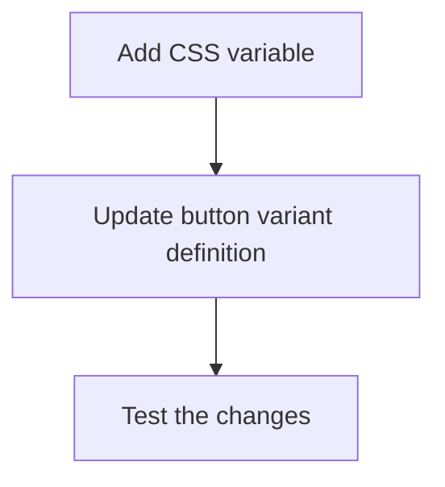

# Fix Button Hover Color to Match Sidebar Background

The "Clear", "Previous", and "Next" buttons all use the "outline" variant from the Button component, which currently uses `hover:bg-accent` for hover styling. We need to modify this to match the sidebar background color.

## Problem Overview

- The "Clear" button in `vips-filter.tsx` uses `variant="outline"` with some custom classes
- The "Previous" and "Next" buttons in `data-pagination.tsx` use `variant="outline"` without custom classes
- The `buttonVariants` in `button.tsx` defines the `outline` variant to use `hover:bg-accent` for hover background
- The sidebar background color is defined in `globals.css` with `--sidebar-bg-start: #1a2035`

## Solution Approach

We'll add a new CSS variable in the global stylesheet that we can reference in the button component.



## Detailed Implementation Steps

### 1. Add CSS variable to globals.css

Open `fortinet-web/app/globals.css` and add a new CSS variable in both theme sections:

```css
/* In the light theme section (around line 85) */
--button-outline-hover-bg: var(--sidebar-bg-start, #1a2035); /* Match sidebar background for button hover */
```

```css
/* In the dark theme section (around line 280) */
--button-outline-hover-bg: var(--sidebar-bg-start, #1a2035); /* Match sidebar background for button hover */
```

### 2. Update the button outline variant in button.tsx

Open `fortinet-web/components/ui/button.tsx` and modify the `outline` variant definition (around line 17):

Current code:
```tsx
outline:
  "border bg-background shadow-xs hover:bg-accent hover:text-accent-foreground dark:bg-input/30 dark:border-input dark:hover:bg-input/50",
```

Change it to:
```tsx
outline:
  "border bg-background shadow-xs hover:bg-[var(--button-outline-hover-bg)] hover:text-white dark:bg-input/30 dark:border-input dark:hover:bg-[var(--button-outline-hover-bg)]",
```

This will make the hover background color match the sidebar background color, and set the text color to white for better contrast.

### 3. Test Your Changes

After making these changes:
1. Launch the application
2. Navigate to a page with pagination or filters
3. Hover over the "Clear", "Previous", and "Next" buttons
4. Verify that the hover background color matches the sidebar background

## Expected Result

When hovering over the "Clear", "Previous", or "Next" buttons, the background color should match the sidebar background color (`#1a2035`), providing a consistent visual experience across the application.