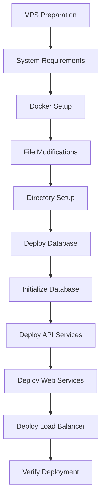

# Fortinet Network Collector - Master VPS Deployment Guide

This comprehensive guide provides a complete strategy for deploying the Fortinet Network Collector application on a Hostinger VPS. It addresses all identified issues from the error logs and provides a step-by-step approach to ensure a successful deployment.

## Table of Contents

1. [Error Analysis](#error-analysis)
2. [Deployment Plan](#deployment-plan)
3. [Pre-Deployment Setup](#pre-deployment-setup)
4. [File Modifications](#file-modifications)
5. [Deployment Process](#deployment-process)
6. [Post-Deployment Verification](#post-deployment-verification)
7. [Troubleshooting](#troubleshooting)
8. [Security Recommendations](#security-recommendations)

## Error Analysis

The following critical issues were identified from the error logs:

1. **Redis Issues**:
   - Permission denied when writing PID file
   - Memory overcommit warning
   - Container permission problems

2. **PostgreSQL Issues**:
   - Insecure authentication method (trust)
   - Missing locale configuration
   - Permission denied when creating backup directories
   - Database relation "firewalls" does not exist

3. **API Issues**:
   - Connection issues to database
   - Missing database tables

## Deployment Plan

The deployment approach follows this sequence:



## Pre-Deployment Setup

Before deployment, ensure your VPS meets these requirements:

1. **System Requirements**:
   - Ubuntu 20.04 LTS or later
   - Minimum 4GB RAM (8GB recommended)
   - 2 CPU cores (4 recommended)
   - 20GB SSD storage

2. **Required Software**:
   - Docker and Docker Compose
   - Basic Linux utilities (curl, wget, etc.)
   - Proper locale settings

3. **System Configuration**:
   - Redis memory overcommit setting
   - Proper locale configuration
   - Directory permissions

Execute these commands to set up your VPS:

```bash
# Update system packages
sudo apt update && sudo apt upgrade -y

# Install required dependencies
sudo apt install -y apt-transport-https ca-certificates curl software-properties-common gnupg lsb-release locales

# Set up locales (required for PostgreSQL)
sudo locale-gen en_US.UTF-8
sudo update-locale LANG=en_US.UTF-8

# Install Docker
curl -fsSL https://download.docker.com/linux/ubuntu/gpg | sudo gpg --dearmor -o /usr/share/keyrings/docker-archive-keyring.gpg
echo "deb [arch=$(dpkg --print-architecture) signed-by=/usr/share/keyrings/docker-archive-keyring.gpg] https://download.docker.com/linux/ubuntu $(lsb_release -cs) stable" | sudo tee /etc/apt/sources.list.d/docker.list > /dev/null
sudo apt update
sudo apt install -y docker-ce docker-ce-cli containerd.io

# Install Docker Compose
sudo curl -L "https://github.com/docker/compose/releases/download/v2.12.2/docker-compose-$(uname -s)-$(uname -m)" -o /usr/local/bin/docker-compose
sudo chmod +x /usr/local/bin/docker-compose

# Add current user to docker group
sudo usermod -aG docker $USER

# Set up Redis memory overcommit
echo "vm.overcommit_memory = 1" | sudo tee -a /etc/sysctl.conf
sudo sysctl vm.overcommit_memory=1
```

**Directory Setup**:

```bash
# Create project directory
mkdir -p ~/fortinet-network-collector
cd ~/fortinet-network-collector

# Create data directories with proper permissions
mkdir -p ./data/postgres
mkdir -p ./data/redis
mkdir -p ./data/nginx/logs
mkdir -p ./backups

# Set proper permissions
sudo chown -R 999:999 ./data/postgres
sudo chown -R 999:999 ./data/redis
sudo chmod -R 777 ./data/nginx/logs
sudo chmod -R 777 ./backups
```

## File Modifications

Three key files need to be modified for successful deployment:

### 1. `docker-compose.yml` Modifications

Key changes required:

- Use explicit volume paths with proper permissions
- Change PostgreSQL authentication from trust to md5
- Add proper user mappings for containers
- Ensure service dependencies with health checks
- Add locale configuration for PostgreSQL

Specific modifications:

```yaml
# Redis service changes
redis:
  # ... existing configuration ...
  user: "999:999"
  volumes:
    - ${PWD}/data/redis:/data
  command: >
    sh -c "
      mkdir -p /data &&
      chown -R redis:redis /data &&
      chmod 700 /data &&
      redis-server /etc/redis/redis.conf
    "

# PostgreSQL service changes
postgres-db:
  # ... existing configuration ...
  environment:
    # ... existing environment variables ...
    - POSTGRES_HOST_AUTH_METHOD=md5  # Change from trust
    - LANG=en_US.utf8
    - LC_ALL=en_US.utf8
  user: "999:999"
  volumes:
    - ${PWD}/data/postgres:/var/lib/postgresql/data
    - ${PWD}/postgres-db/data:/docker-entrypoint-initdb.d
    - ${PWD}/postgres-db/exports:/exports
    - ${PWD}/backups:/backups

# API service dependencies
fortinet-api-1:
  # ... existing configuration ...
  depends_on:
    postgres-db:
      condition: service_healthy
    redis:
      condition: service_healthy
```

### 2. `deploy.sh` Script Modifications

Key changes required:

- Add system configuration check
- Set up proper volume permissions
- Enhance database initialization
- Implement proper service startup order

Add these functions to `deploy.sh`:

```bash
# System configuration check
check_system_configuration() {
    # Check for memory overcommit setting
    # Check for proper locales
    # ... implementation details in deploy_script_modifications.md ...
}

# Setup volume permissions
setup_volume_permissions() {
    # Create required directories
    # Set proper permissions
    # ... implementation details in deploy_script_modifications.md ...
}

# Enhanced database initialization
enhanced_database_init() {
    # Wait for database to be ready
    # Apply schema
    # Verify tables
    # ... implementation details in deploy_script_modifications.md ...
}
```

### 3. Database Initialization

Create these scripts for proper database initialization:

1. `init-db.sh` - A script to initialize the database
2. `postgres-db/data/01-init-schema.sh` - PostgreSQL initialization script
3. `verify-db.sh` - A script to verify database state

See `database_initialization_guide.md` for detailed implementations.

## Deployment Process

Follow these steps for a successful deployment:

1. **Clone or Upload Project Files**:
   ```bash
   git clone [your-repository-url] ~/fortinet-network-collector
   cd ~/fortinet-network-collector
   ```

2. **Apply File Modifications**:
   - Modify `docker-compose.yml` as described
   - Enhance `deploy.sh` with additional functions
   - Create database initialization scripts

3. **Configure Environment**:
   ```bash
   cp .env.example .env
   # Edit .env with secure values
   ```

4. **Deploy Services**:
   ```bash
   # Run the enhanced deployment script
   ./deploy.sh production deploy
   ```

5. **Verify Database Initialization**:
   ```bash
   # Run the database verification script
   ./verify-db.sh
   ```

## Post-Deployment Verification

After deployment, verify that everything is working correctly:

1. **Check Service Status**:
   ```bash
   docker-compose ps
   ```

2. **Check Container Logs**:
   ```bash
   docker-compose logs postgres-db
   docker-compose logs redis
   docker-compose logs fortinet-api-1
   ```

3. **Verify Database Tables**:
   ```bash
   docker-compose exec postgres-db psql -U postgres -d fortinet_network_collector -c "\dt"
   ```

4. **Test API Endpoints**:
   ```bash
   curl http://localhost/api/health
   curl http://localhost/api/firewalls
   ```

## Troubleshooting

If you encounter issues during deployment:

### Redis Issues

- **PID File Permission Error**:
  ```bash
  # Check Redis container logs
  docker-compose logs redis
  
  # Reset Redis data directory permissions
  sudo chown -R 999:999 ./data/redis
  ```

- **Memory Overcommit Warning**:
  ```bash
  # Set memory overcommit setting
  echo "vm.overcommit_memory = 1" | sudo tee -a /etc/sysctl.conf
  sudo sysctl vm.overcommit_memory=1
  ```

### PostgreSQL Issues

- **Authentication Failed**:
  ```bash
  # Check if md5 authentication is set
  docker-compose exec postgres-db cat /var/lib/postgresql/data/pg_hba.conf
  
  # Reset PostgreSQL password
  docker-compose exec postgres-db psql -U postgres -c "ALTER USER postgres WITH PASSWORD 'your_password';"
  ```

- **Missing Tables**:
  ```bash
  # Run database initialization script
  ./init-db.sh
  
  # Check if schema.sql exists
  cat postgres-db/data/schema.sql
  ```

### API Connection Issues

- **API Can't Connect to Database**:
  ```bash
  # Check if PostgreSQL is running
  docker-compose exec postgres-db pg_isready
  
  # Verify DATABASE_URL in environment
  docker-compose exec fortinet-api-1 env | grep DATABASE_URL
  ```

## Security Recommendations

For a production deployment, consider these security enhancements:

1. **Set up a Firewall**:
   ```bash
   sudo ufw allow ssh
   sudo ufw allow http
   sudo ufw allow https
   sudo ufw enable
   ```

2. **Use Secure Passwords**:
   - Generate secure passwords for PostgreSQL
   - Use environment variables instead of hardcoded values

3. **Enable HTTPS**:
   - Configure SSL certificates for Nginx
   - Update Nginx configuration to use HTTPS

4. **Regular Backups**:
   - Set up automated database backups
   - Store backups in a secure location

5. **Monitoring**:
   - Set up container monitoring
   - Configure log aggregation

By following this comprehensive guide, you should be able to successfully deploy the Fortinet Network Collector application on a Hostinger VPS while addressing all the identified issues from the error logs.

---

**Note**: This guide is meant to be used in conjunction with the following detailed documents:
- `install_script.md` - Detailed installation steps
- `deploy_script_modifications.md` - Specific enhancements to deploy.sh
- `docker_compose_modifications.md` - Docker Compose file modifications
- `database_initialization_guide.md` - Database setup procedures